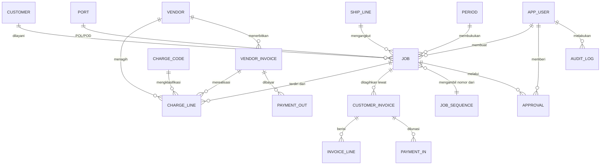

# ERD.md — Model Data ISLI

> ⚠️ DRAFT. Tabel bertanda 🔴 menunggu jawaban di `OPEN-QUESTIONS.md`.
> Agent: jangan buat migrasi untuk tabel 🔴.

## Diagram



---

## Tabel inti

### `job_sequence` — alokasi nomor
```sql
CREATE TABLE job_sequence (
  seq_scope   TEXT    NOT NULL CHECK (seq_scope IN ('DOM','EXP','IMP')),
  year        SMALLINT NOT NULL,
  month       SMALLINT NOT NULL CHECK (month BETWEEN 1 AND 12),
  running     INTEGER NOT NULL DEFAULT 0,
  PRIMARY KEY (seq_scope, year, month)
);
```
> Tiga counter paralel. Ini yang mencegah 16 tabrakan yang terjadi di Excel.

### `job`
```sql
CREATE TABLE job (
  id                UUID PRIMARY KEY,
  seq_scope         TEXT     NOT NULL,
  year              SMALLINT NOT NULL,
  month             SMALLINT NOT NULL,
  running           INTEGER  NOT NULL,
  suffix            TEXT,              -- EXP | IMP | AF | SEAFREIGHT | NULL
  job_no            TEXT     NOT NULL, -- turunan, untuk tampilan & pencarian

  segment           TEXT     NOT NULL CHECK (segment IN ('DOM','EXIM')),
  direction         TEXT     CHECK (direction IN ('EXPORT','IMPORT')),
  service_type      TEXT     NOT NULL CHECK (service_type IN ('FCL','LCL','AF')),

  customer_id       UUID     NOT NULL REFERENCES customer(id),
  sales_user_id     UUID     REFERENCES app_user(id),

  pol_id            UUID     REFERENCES port(id),
  pod_id            UUID     REFERENCES port(id),
  shipper           TEXT,
  consignee         TEXT,
  ship_line_id      UUID     REFERENCES ship_line(id),
  vessel            TEXT,
  qty_ctr           TEXT,              -- "2X20'"
  stuffing_date     DATE,
  etd               DATE,

  leg_trucking      BOOLEAN  NOT NULL DEFAULT false,
  leg_freight       BOOLEAN  NOT NULL DEFAULT false,
  leg_delivery      BOOLEAN  NOT NULL DEFAULT false,

  fx_rate_usd_idr   BIGINT,            -- kurs PER JOB, bukan global

  status            TEXT     NOT NULL DEFAULT 'DRAFT',
  -- Irisan 5 (Q-IRIS5-3): naik saat reject / unlock_granted; approval cycle lama gugur
  approval_cycle    INTEGER  NOT NULL DEFAULT 1,
  period_id         UUID     REFERENCES period(id),

  pod_received_date DATE,              -- Proof of Delivery

  created_by        UUID     NOT NULL REFERENCES app_user(id),
  created_at        TIMESTAMPTZ NOT NULL DEFAULT now(),
  updated_at        TIMESTAMPTZ NOT NULL DEFAULT now(),

  CONSTRAINT uq_job_number UNIQUE (seq_scope, year, month, running),
  CONSTRAINT ck_legs CHECK (
    NOT (leg_trucking AND leg_delivery AND NOT leg_freight)  -- R10: 1+3 tanpa 2 dilarang
  )
);
CREATE INDEX ix_job_no       ON job (job_no);
CREATE INDEX ix_job_customer ON job (customer_id);
CREATE INDEX ix_job_period   ON job (year, month);
```

### `charge_line` — ⭐ tabel terpenting
```sql
CREATE TABLE charge_line (
  id                 UUID PRIMARY KEY,
  job_id             UUID NOT NULL REFERENCES job(id),
  side               TEXT NOT NULL CHECK (side IN ('SELLING','BUYING')),
  charge_code_id     UUID NOT NULL REFERENCES charge_code(id),
  description        TEXT NOT NULL,
  leg                SMALLINT CHECK (leg IN (1,2,3)),   -- opsional

  qty                INTEGER NOT NULL DEFAULT 1,
  currency           TEXT    NOT NULL DEFAULT 'IDR' CHECK (currency IN ('IDR','USD')),
  amount_original    BIGINT  NOT NULL,   -- dalam mata uang asal
  amount_idr         BIGINT  NOT NULL,   -- hasil konversi

  -- sisi SELLING
  is_at_cost         BOOLEAN NOT NULL DEFAULT false,  -- reimburse, keluar dari DPP
  is_taxable         BOOLEAN NOT NULL DEFAULT true,

  -- sisi BUYING
  vendor_id          UUID    REFERENCES vendor(id),
  pencadangan_idr    BIGINT,
  actual_idr         BIGINT,
  selisih_idr        BIGINT GENERATED ALWAYS AS (pencadangan_idr - actual_idr) STORED,
  vendor_invoice_id  UUID    REFERENCES vendor_invoice(id),
  pph23_withheld_idr BIGINT  NOT NULL DEFAULT 0,

  line_status        TEXT NOT NULL DEFAULT 'PENCADANGAN'
                       CHECK (line_status IN ('PENCADANGAN','ACTUAL','LOCKED')),

  created_at         TIMESTAMPTZ NOT NULL DEFAULT now(),

  CONSTRAINT ck_selling_no_vendor CHECK (side <> 'SELLING' OR vendor_id IS NULL),
  CONSTRAINT ck_buying_has_vendor CHECK (side <> 'BUYING'  OR vendor_id IS NOT NULL)
);
CREATE INDEX ix_cl_job ON charge_line (job_id, side);
```

> **Invariant aplikasi (tidak bisa lewat CHECK):** untuk `is_at_cost = true`,
> total selling harus sama dengan total buying pada charge code yang sama.
> Ditegakkan di `domain/costing/`. Lihat R4.3.

### `charge_code`
```sql
CREATE TABLE charge_code (
  id                UUID PRIMARY KEY,
  code              TEXT NOT NULL UNIQUE,   -- OF, THC, DOORING
  name_id           TEXT NOT NULL,
  category          TEXT NOT NULL,          -- FREIGHT|TERMINAL|DARAT|DOKUMEN|INTERNAL
  default_leg       SMALLINT,
  is_taxable        BOOLEAN NOT NULL DEFAULT true,
  is_at_cost_default BOOLEAN NOT NULL DEFAULT false,
  pph23_applicable  BOOLEAN NOT NULL DEFAULT false,
  segment_scope     TEXT NOT NULL DEFAULT 'BOTH' CHECK (segment_scope IN ('DOM','EXIM','BOTH')),
  wajib_muncul      BOOLEAN NOT NULL DEFAULT false,  -- R15.5: true = FIXED (selalu ada per job), false = OPSIONAL (ad-hoc)
  active            BOOLEAN NOT NULL DEFAULT true
);
```

### `customer_invoice`
```sql
CREATE TABLE customer_invoice (
  id              UUID PRIMARY KEY,
  job_id          UUID NOT NULL REFERENCES job(id),
  customer_id     UUID NOT NULL REFERENCES customer(id),

  running         INTEGER NOT NULL,
  inv_type        TEXT NOT NULL CHECK (inv_type IN ('INVDOM','INVEXP')),
  issue_month     SMALLINT NOT NULL,
  issue_year      SMALLINT NOT NULL,
  invoice_no      TEXT NOT NULL,   -- turunan: 017-INVDOM/ISLI-26.06-012/VII/2026

  is_reimburse_invoice BOOLEAN NOT NULL DEFAULT false,

  -- angka DIBEKUKAN saat issue
  sub_total_idr   BIGINT NOT NULL,
  reimburse_idr   BIGINT NOT NULL DEFAULT 0,
  dpp_idr         BIGINT NOT NULL,
  ppn_rate_bp     INTEGER NOT NULL DEFAULT 110,   -- basis poin: 110 = 1,1%
  ppn_idr         BIGINT NOT NULL,
  pph23_applied   BOOLEAN NOT NULL DEFAULT false,
  pph23_rate_bp   INTEGER NOT NULL DEFAULT 200,   -- 200 = 2%
  pph23_idr       BIGINT NOT NULL DEFAULT 0,
  grand_total_idr BIGINT NOT NULL,
  terbilang       TEXT   NOT NULL,
  tax_rule_version TEXT  NOT NULL,

  status          TEXT NOT NULL DEFAULT 'DRAFT',
  issue_date      DATE,
  sent_date       DATE,
  top_days        INTEGER,
  due_date        DATE,

  issued_before_pod       BOOLEAN NOT NULL DEFAULT false,  -- R9.4b, jalur khusus
  early_issue_approved_by UUID REFERENCES app_user(id),    -- wajib jika issued_before_pod

  CONSTRAINT uq_inv UNIQUE (inv_type, issue_year, running),
  CONSTRAINT ck_early_issue_needs_approval CHECK (
    (issued_before_pod = false) OR (early_issue_approved_by IS NOT NULL)
  )
);
```

### `customer_invoice_addendum` ⚠️ baru, R16 — sebagian masih asumsi
```sql
CREATE TABLE customer_invoice_addendum (
  id                  UUID PRIMARY KEY,
  original_invoice_id UUID NOT NULL REFERENCES customer_invoice(id),
  addendum_seq         INTEGER NOT NULL,   -- 1, 2, 3... per invoice asal

  -- nomor yang tercetak DISALIN dari original_invoice_id.invoice_no saat cetak,
  -- TIDAK disimpan ulang sebagai teks bebas -- lihat R16.2
  label_internal       TEXT NOT NULL,       -- wajib, contoh: 'SUSULAN-1'
  alasan               TEXT NOT NULL,       -- wajib, masuk audit_log

  amount_idr           BIGINT NOT NULL,     -- selisih; boleh negatif (koreksi turun)

  -- pajak selisih dihitung SENDIRI, bukan menyentuh angka invoice asal (R16.3)
  dpp_idr             BIGINT NOT NULL,
  ppn_idr             BIGINT NOT NULL,
  pph23_applied       BOOLEAN NOT NULL DEFAULT false,
  pph23_idr           BIGINT NOT NULL DEFAULT 0,
  grand_total_idr     BIGINT NOT NULL,
  tax_rule_version    TEXT NOT NULL,        -- versi SAAT ADDENDUM terbit, bukan versi invoice asal

  issue_month          SMALLINT NOT NULL,   -- periode "bulan berikutnya"
  issue_year           SMALLINT NOT NULL,

  status                TEXT NOT NULL DEFAULT 'DRAFT',  -- DRAFT | DISETUJUI | ISSUED
  created_by           UUID NOT NULL REFERENCES app_user(id),
  approved_by           UUID REFERENCES app_user(id),   -- Manager/Owner, bukan created_by (R16.5)

  -- kunci unik SEBENARNYA -- bukan di teks nomor invoice, supaya nomor boleh identik
  CONSTRAINT uq_addendum UNIQUE (original_invoice_id, addendum_seq)
);
```

> ⚠️ R16.3 (pajak atas selisih) dan R16.5 (tingkat approval) masih **asumsi**,
> menunggu Q69. Kolomnya sudah siap dipakai; nilainya baru pasti setelah dijawab.

### `vendor_invoice` — ✅ diselaraskan ke skema aktual (Irisan 7, 17 Agu 2026)
```sql
-- Skema aktual (migrasi 0000 + 0007_iris7_vendor_invoice). Kolom lama rancangan
-- (is_reimbursement, due_date, received_by) TIDAK ada di skema — catat deviasi,
-- jangan dibuat diam-diam.
CREATE TABLE vendor_invoices (
  id                 UUID PRIMARY KEY,
  vendor_id          UUID NOT NULL REFERENCES vendors(id),
  vendor_invoice_no  TEXT NOT NULL,          -- persis dari kertas vendor (01A/01B)
  tanggal_invoice    DATE NOT NULL,
  jumlah_idr         BIGINT NOT NULL,        -- ADR-0002: BIGINT rupiah
  pph23_idr          BIGINT NOT NULL DEFAULT 0, -- R3.7 ⚠️ DUGAAN — input manual, Q14
  status             vendor_invoice_status NOT NULL DEFAULT 'DITERIMA',
                     -- DITERIMA | DIVERIFIKASI | DIBAYAR | DIBATALKAN (D1:
                     -- skema 4-state menang; dispute/reject dilipat + alasan)
  diterima_oleh      UUID REFERENCES users(id),  -- Irisan 7: dasar R-A1 verify
  diverifikasi_oleh  UUID REFERENCES users(id),  -- Irisan 7: jejak verify
  diverifikasi_at    TIMESTAMPTZ,                -- Irisan 7
  dibayar_at         TIMESTAMPTZ,                -- terisi = TERKUNCI (R-A5)
  dibayar_oleh       UUID REFERENCES users(id),
  created_at         TIMESTAMPTZ NOT NULL DEFAULT now(),

  -- ⭐ INI yang mencegah kasus 01A / 01B (R7.1)
  CONSTRAINT uq_vendor_invoice UNIQUE (vendor_id, vendor_invoice_no)
);
```

### `vendor_invoice_lines` — junction verifikasi (Irisan 7, D5)
```sql
CREATE TABLE vendor_invoice_lines (
  id                UUID PRIMARY KEY,
  vendor_invoice_id UUID NOT NULL REFERENCES vendor_invoices(id) ON DELETE CASCADE,
  charge_line_id    UUID NOT NULL REFERENCES charge_lines(id),
  jumlah_idr        BIGINT NOT NULL,

  -- ⭐ D5: satu charge line = SATU verifikasi invoice vendor (anti
  --   double-verification di level DB). Partial/multiple = irisan terpisah.
  CONSTRAINT uq_vendor_inv_line_charge_line UNIQUE (charge_line_id)
);
```
> Verifikasi (V-INV-5) INSERT baris junction ini DAN mengisi
> `charge_lines.actual_idr` (satu-satunya pintu setelah D7).
> `batal` sebelum bayar MENGHAPUS junction + reset `actual_idr` NULL
> (baris bebas diverifikasi ulang — alur revisi Bu Niken); `batal`/`DIBAYAR`
> tidak pernah menyentuhnya (V-INV-4).
>
> **Deviasi vs rancangan lama (jangan dibuat diam-diam):** `PAYMENT_OUT`
> hanya ada di diagram konseptual — tidak pernah dibuat; pembayaran vendor =
> kolom `dibayar_at/dibayar_oleh` (manual, tanpa partial). `charge_lines`
> aktual TIDAK punya `vendor_invoice_id` maupun `line_status` kolom — status
> PENCADANGAN/ACTUAL/LOCKED (STATE-MACHINE §4) adalah TURUNAN query
> (`statusChargeLine`), bukan kolom tersimpan.

### `vendor_invoice_addendum` ✅ baru, R17 -- simetris dengan customer_invoice_addendum
```sql
CREATE TABLE vendor_invoice_addendum (
  id                          UUID PRIMARY KEY,
  original_vendor_invoice_id  UUID NOT NULL REFERENCES vendor_invoice(id),
  addendum_seq                 INTEGER NOT NULL,

  label_internal               TEXT NOT NULL,     -- wajib
  alasan                       TEXT NOT NULL,     -- wajib, masuk audit_log

  jumlah_idr                   BIGINT NOT NULL,   -- selisih/sisa; boleh negatif
  pph23_applied                BOOLEAN NOT NULL DEFAULT false,
  pph23_idr                    BIGINT NOT NULL DEFAULT 0,

  issue_month                  SMALLINT NOT NULL,
  issue_year                   SMALLINT NOT NULL,

  status                       TEXT NOT NULL DEFAULT 'DRAFT',  -- DRAFT | DISETUJUI | ISSUED
  created_by                   UUID NOT NULL REFERENCES app_user(id),
  approved_by                  UUID REFERENCES app_user(id),   -- Manager/Owner, ≠ created_by
  dibayar_at                    TIMESTAMPTZ,       -- dipakai hitung sisa kuota (R17.3)

  -- kunci unik SEBENARNYA -- uq_vendor_inv di vendor_invoice tetap berlaku, tidak dilonggarkan
  CONSTRAINT uq_vendor_addendum UNIQUE (original_vendor_invoice_id, addendum_seq)
);
```
> Sisa kuota belum dibayar = `vendor_invoice.amount_idr` - SUM(`jumlah_idr`
> WHERE `dibayar_at` IS NOT NULL) -- dihitung saat tampil, tidak disimpan (R17.3).

### `cost_reopen_request` ✅ baru, formalisasi R6.4 -- wajib berita acara
```sql
CREATE TABLE cost_reopen_request (
  id                     UUID PRIMARY KEY,
  job_id                 UUID NOT NULL REFERENCES job(id),

  requested_by           UUID NOT NULL REFERENCES app_user(id),  -- PIC
  co_signed_by           UUID REFERENCES app_user(id),           -- Sales

  berita_acara_file_url  TEXT NOT NULL,   -- wajib unggah sebelum diajukan
  alasan                 TEXT NOT NULL,   -- wajib, masuk audit_log
  nilai_tambahan_idr     BIGINT,

  status                 TEXT NOT NULL DEFAULT 'DIAJUKAN',  -- DIAJUKAN | DISETUJUI | DITOLAK
  decided_by             UUID REFERENCES app_user(id),      -- wajib Owner, ≠ requested_by
  decided_at             TIMESTAMPTZ,
  catatan_keputusan      TEXT,

  created_at             TIMESTAMPTZ NOT NULL DEFAULT now()
);
```
> Tidak ada ambang nilai minimum yang boleh melewati proses ini -- klien
> menegaskan "mau 100, mau 50, mau 300, mau sejuta pun" tetap wajib (R6.4).


### `approval`
```sql
CREATE TABLE approval (
  id           UUID PRIMARY KEY,
  job_id       UUID NOT NULL REFERENCES job(id),
  level        TEXT NOT NULL CHECK (level IN ('L1','FINAL')),
  cycle        INTEGER NOT NULL DEFAULT 1,   -- naik setiap kali di-unlock
  action       TEXT NOT NULL CHECK (action IN ('APPROVED','REJECTED')),
  actor_id     UUID NOT NULL REFERENCES app_user(id),
  reason       TEXT,
  created_at   TIMESTAMPTZ NOT NULL DEFAULT now()
);
```
> Kolom `cycle` mengimplementasikan R6.2: unlock → cycle+1 → semua approval
> siklus lama tidak lagi berlaku. Approval lama **tidak dihapus**, hanya tidak
> terpakai. Jejak audit utuh.

### `audit_log`
```sql
CREATE TABLE audit_log (
  id          BIGSERIAL PRIMARY KEY,
  entity_type TEXT NOT NULL,
  entity_id   UUID NOT NULL,
  action      TEXT NOT NULL,
  actor_id    UUID NOT NULL REFERENCES app_user(id),
  old_value   JSONB,
  new_value   JSONB,
  reason      TEXT,
  created_at  TIMESTAMPTZ NOT NULL DEFAULT now()
);
CREATE INDEX ix_audit_entity ON audit_log (entity_type, entity_id, created_at DESC);
-- append-only: REVOKE UPDATE, DELETE ON audit_log FROM app_role;
```

### Master data
```sql
CREATE TABLE customer (
  id UUID PRIMARY KEY,
  name TEXT NOT NULL,
  legal_name TEXT,
  npwp TEXT,
  address TEXT,
  default_top_days INTEGER,
  is_pph23_withholder BOOLEAN,   -- 🔴 menunggu Q04
  active BOOLEAN NOT NULL DEFAULT true
);

CREATE TABLE vendor (
  id UUID PRIMARY KEY,
  name TEXT NOT NULL,
  legal_name TEXT,
  npwp TEXT,
  vendor_type TEXT,              -- PELAYARAN|TRUCKING|DOORING|EMKL|LAINNYA
  payment_term TEXT,             -- CASH|TEMPO
  payment_term_days INTEGER,
  active BOOLEAN NOT NULL DEFAULT true
);

CREATE TABLE port      (id UUID PRIMARY KEY, code TEXT UNIQUE, name TEXT NOT NULL, country TEXT NOT NULL DEFAULT 'ID');
CREATE TABLE ship_line (id UUID PRIMARY KEY, code TEXT UNIQUE, name TEXT NOT NULL);
CREATE TABLE period    (id UUID PRIMARY KEY, year SMALLINT, month SMALLINT, status TEXT DEFAULT 'OPEN', UNIQUE(year,month));
CREATE TABLE app_user  (id UUID PRIMARY KEY, email TEXT UNIQUE NOT NULL, name TEXT NOT NULL, role TEXT NOT NULL, active BOOLEAN DEFAULT true);
```

---

## Tabel yang DITUNDA 🔴

| Tabel | Menunggu |
|---|---|
| ~~`cost_reallocation`~~ | ✅ **DIBANGUN 13 Agu 2026** sebagai `cost_reallocations` — ADR-0006 Opsi B diterima. Lihat DDL di bawah. |
| ~~`gsoft_mapping`~~ | ❌ **DIBATALKAN PERMANEN** 13 Agu 2026 — gsoft milik perusahaan lama Pak Indra, tidak ada kaitan dengan ISLI. Jangan dibuat. |
| `cash_dropping` | Phase 2 — aliran dana Pak Teguh |
| `tax_report_period` | Phase 2 |
| `attachment` | Q21 — apakah perlu upload dokumen |

### `cost_reallocations` — ADR-0006 Opsi B

```sql
CREATE TABLE cost_reallocation (
  id                    UUID PRIMARY KEY,
  origin_charge_line_id UUID NOT NULL REFERENCES charge_line(id),
  origin_job_id         UUID NOT NULL REFERENCES job(id),
  destination_job_id    UUID NOT NULL REFERENCES job(id),
  jumlah_idr            BIGINT NOT NULL CHECK (jumlah_idr > 0),
  alasan                TEXT NOT NULL,
  created_by            UUID NOT NULL REFERENCES app_user(id),
  approved_by           UUID REFERENCES app_user(id),
  approved_at           TIMESTAMPTZ,
  created_at            TIMESTAMPTZ NOT NULL DEFAULT now(),
  CONSTRAINT ck_realloc_not_self CHECK (origin_job_id != destination_job_id)
);
```

Catatan: baris charge line di job asal TIDAK dipindahkan atau dihapus — nilai
aslinya tetap utuh. Realokasi hanya menandai sebagian nilainya sebagai
dipindahkan secara logis untuk perhitungan GP tampilan (GP asli vs GP setelah
realokasi, R5.3).

---

## Catatan desain

1. **`job_no` bukan primary key.** Kunci alami adalah komposit 4 kolom.
2. **Semua uang `BIGINT`.** Nol pengecualian.
3. **Tarif pajak sebagai basis poin integer.** `110` = 1,1%. Menghindari float.
4. **`tax_rule_version` di invoice.** Invoice lama tetap benar saat aturan berubah.
5. **`selisih_idr` generated column.** Tidak bisa tidak sinkron.
6. **Approval pakai `cycle`, bukan hapus.** Riwayat lengkap tetap ada.


---

## Tambahan 13 Agu 2026 — kolom baru

```sql
-- job: alasan kalau kombinasi leg domestik menyimpang dari 1+2+3 (R10)
ALTER TABLE job ADD COLUMN leg_override_reason TEXT;

-- job: pagar keras kombinasi leg, MENGGANTI ck_legs yang lama (R10)
ALTER TABLE job DROP CONSTRAINT IF EXISTS ck_legs;
ALTER TABLE job ADD CONSTRAINT ck_legs CHECK (
  NOT (leg_trucking AND leg_delivery AND NOT leg_freight)   -- 1+3 tanpa 2 mustahil
  AND (leg_trucking OR leg_freight OR leg_delivery)         -- minimal satu leg
);

-- charge_code: apakah kode biaya ini wajib menyebut vendor (R15.3)
ALTER TABLE charge_code ADD COLUMN needs_vendor BOOLEAN NOT NULL DEFAULT true;
```

### Indeks tambahan untuk halaman peringkat (R14)

```sql
-- peringkat sales & rute dalam rentang periode
CREATE INDEX ix_job_sales  ON job (sales, year, month);
CREATE INDEX ix_job_rute   ON job (rute, year, month);
```

> ⚠️ `charge_line.vendor_id` tetap **NULLABLE** dengan sengaja. Kewajibannya
> bergantung pada `charge_code.needs_vendor`, jadi ditegakkan di lapis aplikasi.
> Menjadikannya `NOT NULL` akan menggagalkan migrasi data historis — lihat R15.4.
